### 函数

#### 单行函数

1. 数值函数  
   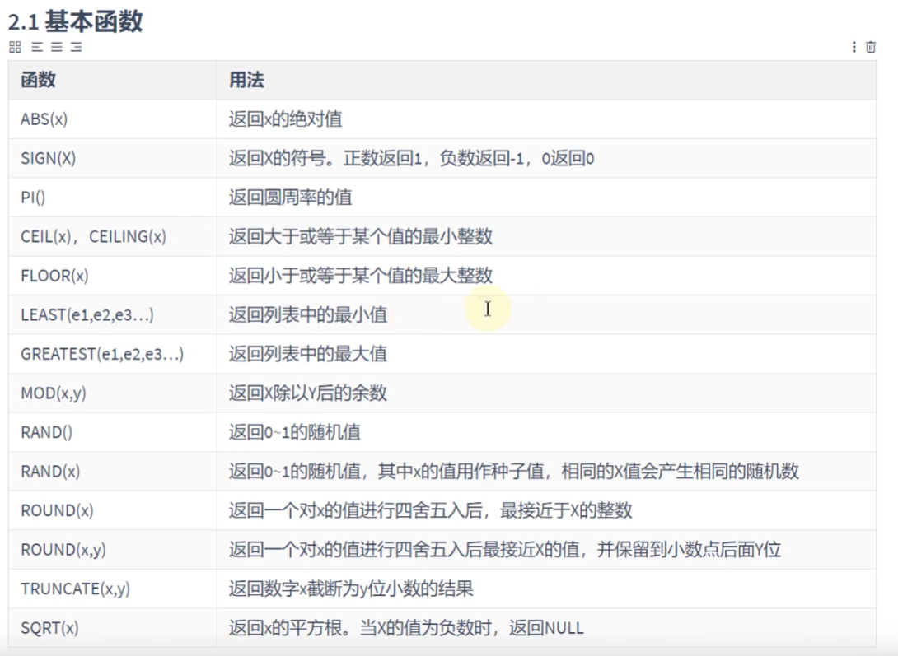  
   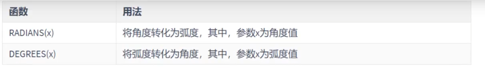  
   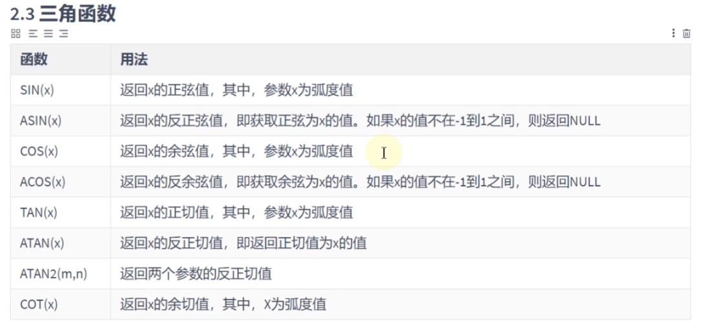  
   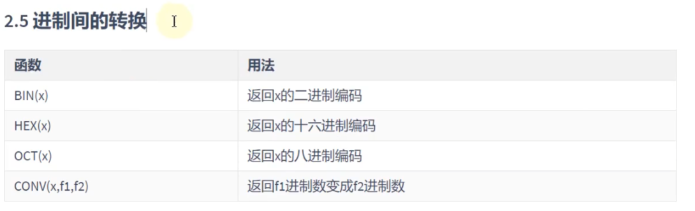

2. 字符串函数  
   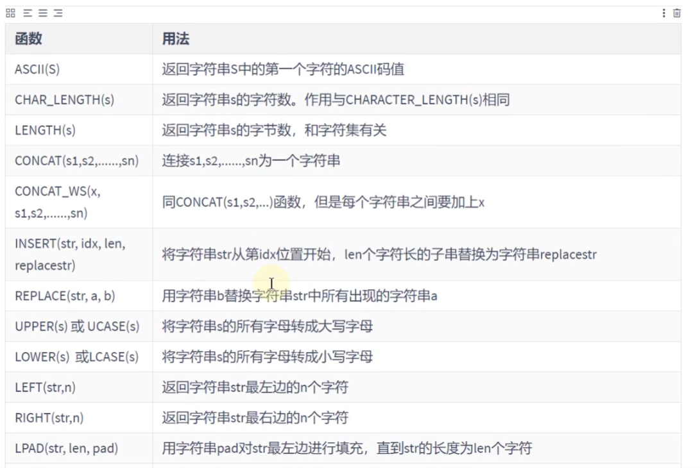  
   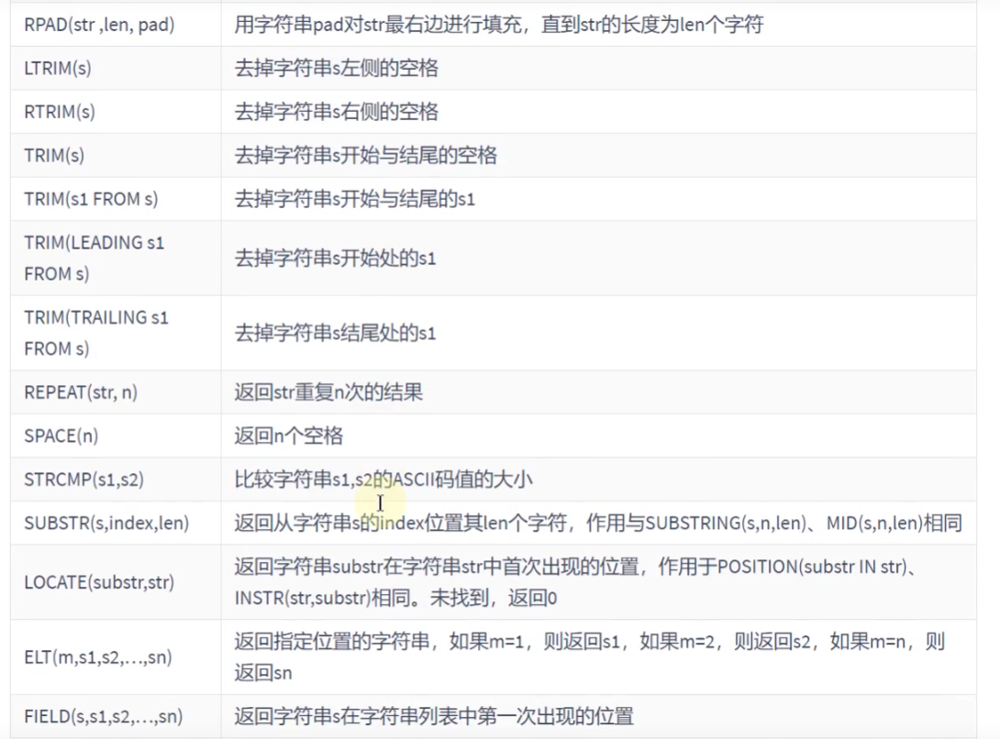  
   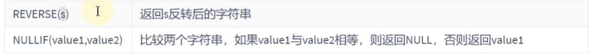

3. 日期和时间函数  
   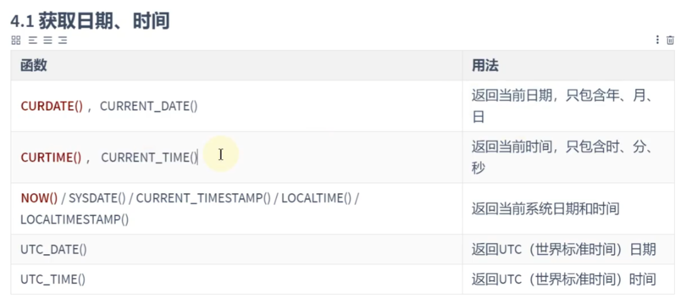  
   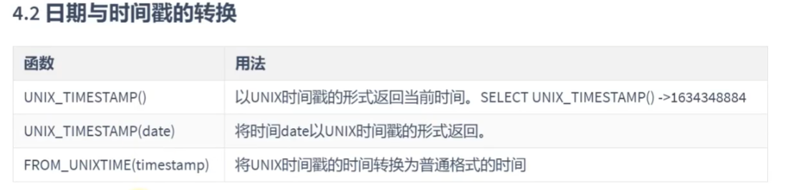  
   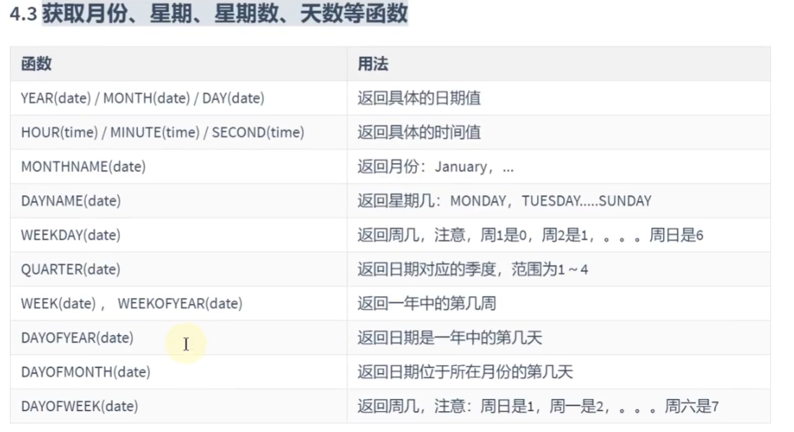  
   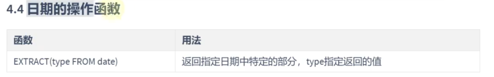  
   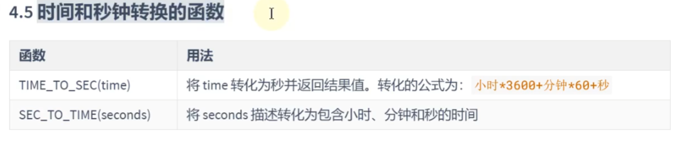  
   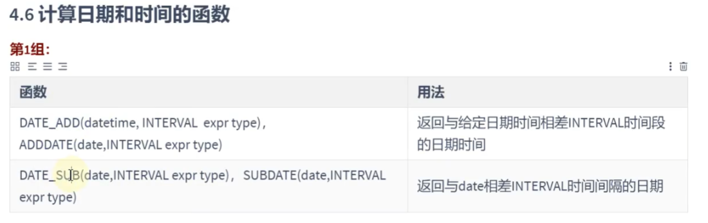  
   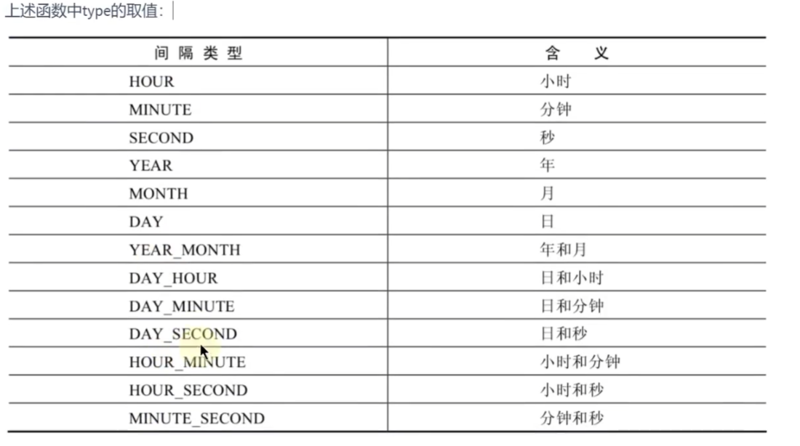  
   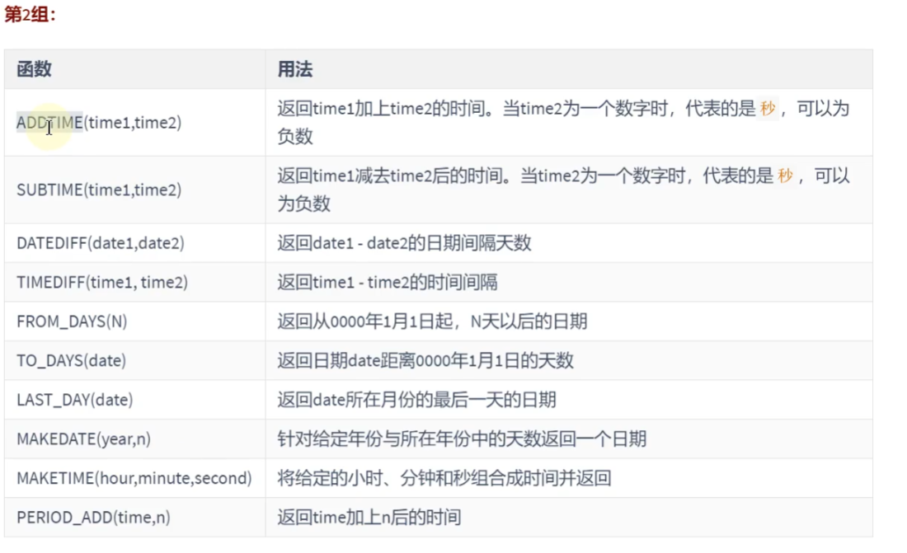  
   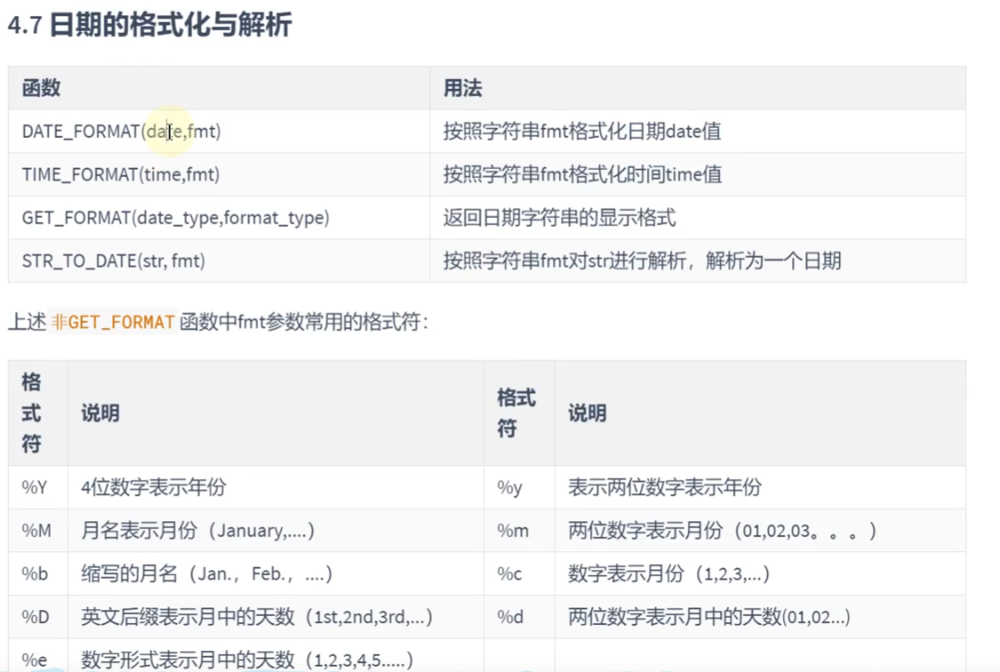

4. 流程控制函数  
   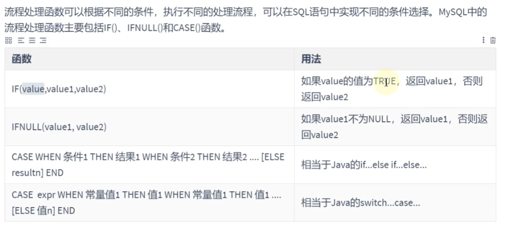

5. 加密与解密函数  
   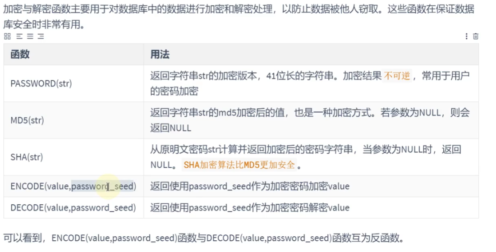

6. MySQL的信息函数  
   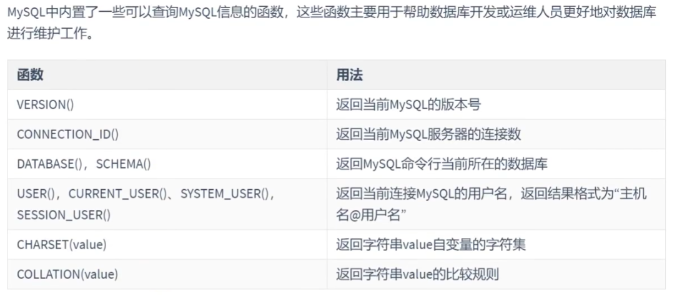

7. 其他函数  
   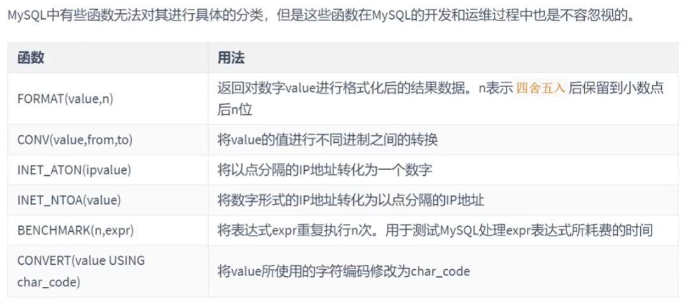

#### 聚合函数

1. 常见的聚合函数

```sql
# AVG = SUM / COUNT
# AVG / SUM
SELECT AVG(salary), SUM(salary), AVG(salary) * 107, SUM(commission_pct)
FROM employees;

# MAX / MIN
SELECT MAX(salary), MIN(salary)
FROM employees;

SELECT MAX(last_name)
FROM employees;

# COUNT
SELECT COUNT(employee_id)
FROM employees;

# 如果指定字段，不算null值
SELECT COUNT(employee_id), COUNT(department_id), COUNT(commission_pct), COUNT(1)
FROM employees;
```

2. GROUP BY的使用

3. HAVING的使用

4. SQL底层执行原理  


