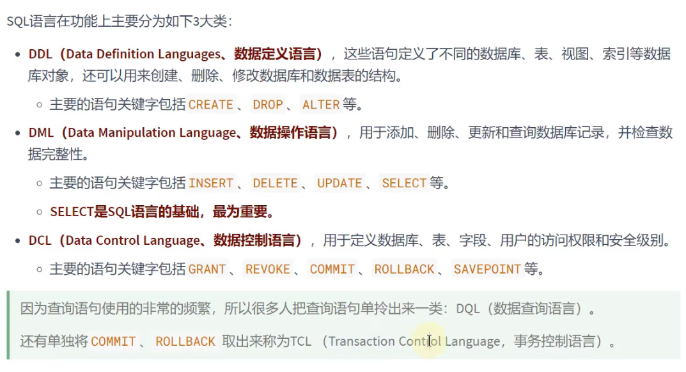
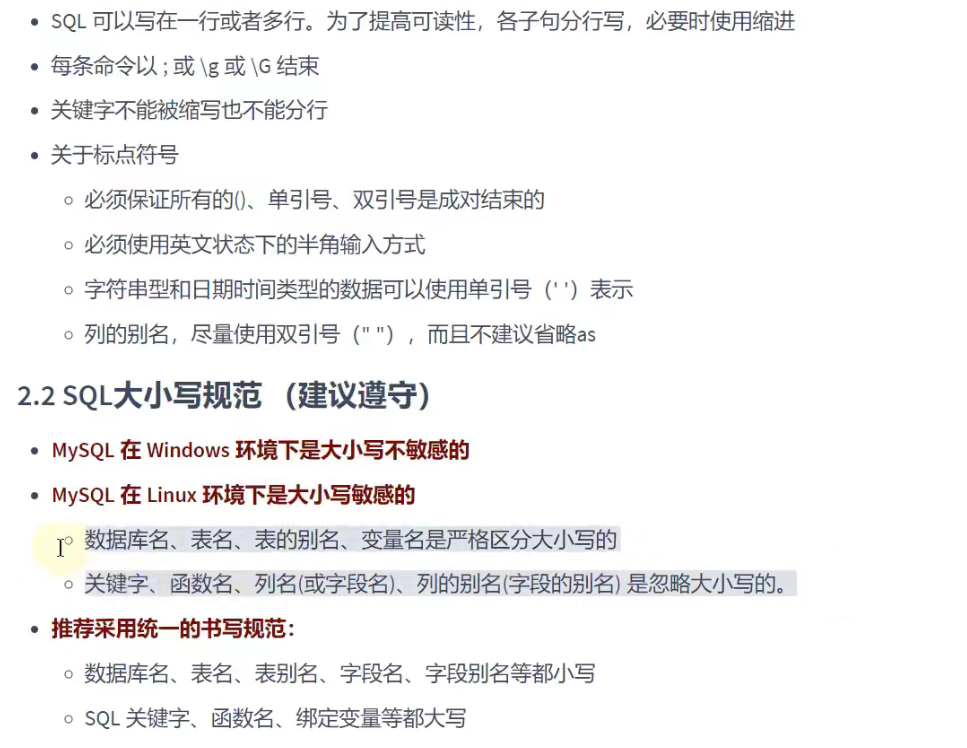
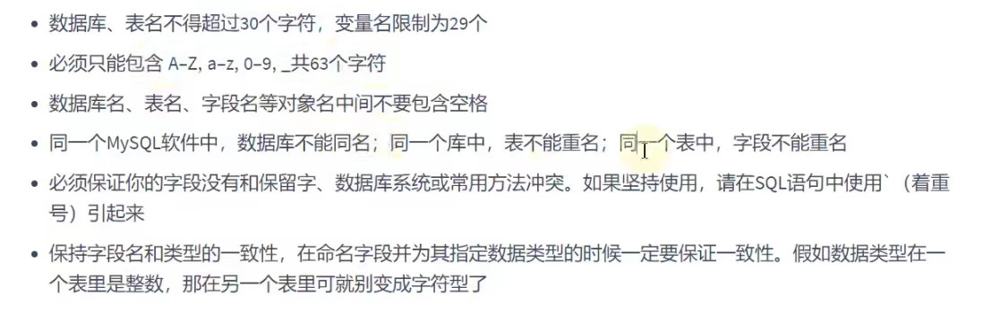
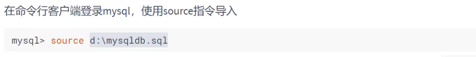

### 初识SELECT

#### 基本的select语句

1. SQL的分类  
   
2. 基本规则与大小写规范  
   
3. 命名规则  
   
4. 数据导入指令  
   

5. 最基本的SELECT语句:SELECT 字段1, 字段2, ... FROM 表明

```sql
SELECT 1 + 1, 3 * 2;

SELECT 1 + 1, 3 * 2
FROM DUAL;
# dual:伪表

# *:表中所有的字段（或列）
SELECT *
FROM employees;
```

6. 列的别名

```sql
# as:alias(别名)
# 列的别名可以用一对""引起来,mysql可以使用'',但是不要使用'',因为只是mysql不严谨,可以是中文
SELECT employee_id emp_id, last_name AS lname, department_id "deptId"
FROM employees;
```

7. 去除重复行

```sql
# 查询员工表中一共有哪些部门id
# DISTINCT
SELECT DISTINCT department_id
FROM employees;
```

8. 空值参与运算

```sql
# 空值:null
# null不等于0,'','null'
SELECT commission_pct
FROM employees;

# commission_pct为null的话则年工资为null
# 空值参与运算，结果也一定为空
SELECT employee_id, salary "月工资", salary * (1 + commission_pct) * 12 "年工资", commission_pct
FROM employees;

SELECT employee_id, salary "月工资", salary * (1 + IFNULL(commission_pct, 0)) * 12 "年工资", commission_pct
FROM employees;
```

9. 着重号``

```sql
# order是排序关键字(不应该以其为表明，仅示例)，要用的时候要加着重号
SELECT *
FROM 'order';
```

10. 查询常数

```sql
# 每行前面都会加一个字段'尚硅谷'
SELECT '尚硅谷', employee_id, last_name
FROM employees;
```

11. 显示表结构

```sql
# 显示表中字段的详细信息
DESCRIBE employees;
DESC employees;
```

12. 过滤数据(WHERE,一定要在FROM后面)

```sql
SELECT *
FROM employees
# 过滤条件
WHERE department_id = 90;

SELECT *
FROM employees
# 仍然能查出King的员工，是因为mysql不严谨造成的
WHERE last_name = 'king';
```


