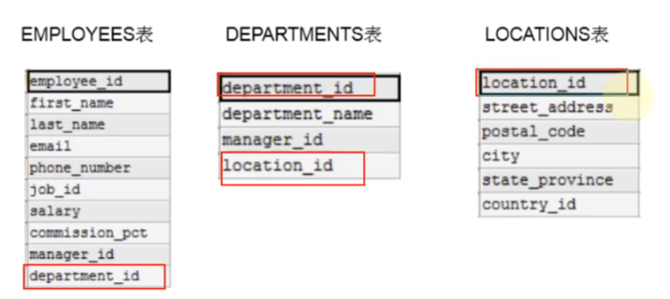
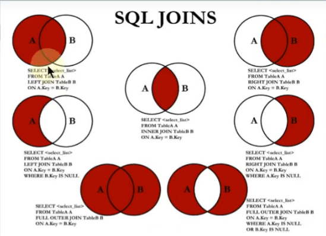

### 多表查询



```sql

# 错误，查询2889条数据，107 * 27
# 每个员工和每个部门都匹配了一遍，出现笛卡尔积的错误
SELECT employee_id, department_name
FROM employees,
     departments;

# 正确条件，需要有连接条件
# 如果查血字段中出现了多个表中都存在的字段，则必须指明此字段所在的表
# 从sql优化的角度，建议查询多表查询时，建议每个字段前都指明其所在的表
# 可以给表起别名，在SELECT 和 WHERE中使用表的表明，有别名之后只能用别名了
SELECT employee_id, department_name, employees.department_id
FROM employees,
     departments
WHERE employees.department_id = departments.department_id;
```

#### 多表查询分类

1. 等值连接 vs 非等值连接

```sql
SELECT *
FROM job_grades;

# 非等值连接
SELECT last_name, salary, grade_level
FROM employees,
     job_grades
WHERE employees.salary between job_grades.lowest_sal AND job_grades.highest_sal;
```

2. 自连接 vs 非自连接

```sql
# 自连接
# 查询员工id，员工姓名及其管理者的id，姓名，管理者也是员工
SELECT emp.employee_id, emp.last_name, mgr.employee_id, mgr.last_name
FROM employees emp,
     employees mgr
WHERE emp.manager_id = mgr.employee_id;
```

3. 内连接 vs 外连接
   

```sql
# 内连接:合并具有同一列的两个以上的表的行，
#       结果集中不包含一个表与另一个表不匹配的行
#       员工部门为null就查不出来了
#       部门中没有员工的部门也查不出来
SELECT employee_id, department_name, employees.department_id
FROM employees,
     departments
WHERE employees.department_id = departments.department_id;

# 外连接:合并具有同一列的两个以上的表的行，
#       结果集中除了包含一个表与另一个表匹配的行之外，
#       还查询到了左表 或 右表中不匹配的行
# 分类：左外连接（还有左表数据），又外连接（还有右表数据），满外连接（都有）

# 查询所有员工的last_name, department_name信息
# sql92：使用+，mysql不支持该写法
/*
SELECT employee_id, department_name, employees.department_id
FROM employees,
     departments
WHERE employees.department_id = departments.department_id(+);
*/

# sql99：使用JOIN ... ON语法
# 内连接,106条数据
SELECT employee_id, department_name, e.department_id, l.city
FROM employees e
         JOIN departments d
              ON e.department_id = d.department_id
         JOIN locations l ON d.location_id = l.location_id;
# 左外连接,107条数据
SELECT employee_id, department_name, e.department_id
FROM employees e
         LEFT OUTER JOIN departments d
                         ON e.department_id = d.department_id;
# 右外连接,122条数据
SELECT employee_id, department_name, e.department_id
FROM employees e
         RIGHT OUTER JOIN departments d
                          ON e.department_id = d.department_id;
# 满外连接:FULL OUTER JOIN，mysql不支持,
/*
SELECT employee_id, department_name, e.department_id
FROM employees e
         FULL OUTER JOIN departments d
                          ON e.department_id = d.department_id;
*/
# UNION 和 UNION ALL ，UNION去重，建议能用UNION用UNION

# 满外连接
SELECT employee_id, department_name
FROM employees e
         LEFT JOIN departments d ON e.department_id = d.department_id
UNION ALL
SELECT employee_id, department_name
FROM employees e
         RIGHT JOIN departments d ON d.department_id = e.department_id
WHERE e.department_id IS NULL;
```


