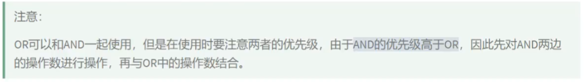

### 运算符

#### 算数运算符

```sql
# + - * / div % mod
# 结果为101，+没有类似java中的连接作用，只表示加法运算，此时会将字符串转换为数值（隐式转换）
SELECT 100 + '1'
FROM dual;

# 结果为100，不能转化看做0
SELECT 100 + 'a'
FROM dual;

# null参与运算结果为null
SELECT 100 + null
FROM dual;

# 结果50.0000，整形除整形为浮点型
SELECT 100 / 2
FROM dual;

# DIV 结果50，整数除法，结果取整，分母为0结果为null
SELECT 100.2 DIV 2
FROM dual;

# 取模运算:% mod，结果符号与被模数相同
SELECT -12 % -5
FROM dual;
```

#### 比较运算符


```sql

# 只要有null参与运算，结果为null，而where过滤所有结果不为1的
# 换成!=也一样
SELECT employee_id, commission_pct
FROM employees
WHERE commission_pct = null;

# <=>安全等于，用于解决null问题
SELECT employee_id, commission_pct
FROM employees
WHERE commission_pct <=> null;

```

#### 关键字


```sql
# NOT放在salary前一样
SELECT employee_id, last_name, salary
FROM employees
WHERE salary NOT BETWEEN 6000 AND 8000;

# LIKE忽略大小写
SELECT last_name
FROM employees
WHERE last_name LIKE '%a%';

# %代表0,1,多个
# _代表一个，如果想用_，用默认转义字符\_,可以用ESCAPE ''指定转义字符
SELECT last_name
FROM employees
WHERE last_name LIKE '_$_a%' ESCAPE '$';
```

#### 逻辑运算符

  



```sql
SELECT ~1 & 10
FROM dual;
```


